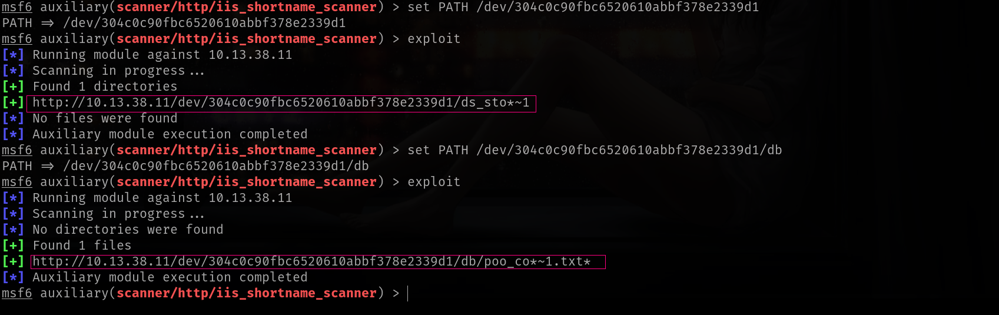

## Entry
Sometimes, small oversights lead to big leaks. In this post, we’ll look at two classic tricks: leaking hidden file names with .DS_Store files on macOS servers, and abusing the ~ character on Windows servers to guess real file names. Both can reveal sensitive paths without needing complex exploits—just clever enumeration.

### ➜ recognize DS_store


Generally we skip this part at pentest for its just Blank IIS page but there is also something important sometimes. How to reach out?


After confirming that .DS_Store is accessible using Nikto, I used [DS_Walk](https://github.com/Keramas/DS_Walk) to automatically parse the file and recursively discover hidden directories and files. This tool exploits how .DS_Store stores metadata about folder contents—even when directory listing is disabled—allowing attackers to reconstruct the structure of the web server.

### ➜ DS_Walk using


There is also we can see whats different between `feroxbuster` which is normally dir scan fuzzer.

Okey now we can reach out files with really great metasploit tools and create or FUZZ list.


and we got `http://10.13.38.11//dev/304c0c90fbc6520610abbf378e2339d1` before. Now we can Fuzz with this `UUID` name.



We can guess name but for sure  but to be sure lets create wordlist.

### ➜ Create custom wordlist

```sh
➜  Entry grep '^co.*' /usr/share/seclists/Discovery/Web-Content/directory-list-2.3-medium.txt > fuzzing.txt
➜  Entry cat fuzzing.txt 
contact
content
contactus
[SNIP]
```
Command to run
```sh
ffuf -w fuzzing.txt -u 'http://10.13.38.11/dev/304c0c90fbc6520610abbf378e2339d1/db/poo_FUZZ.txt' 
```
Andd BOOOOMMMM!!!


